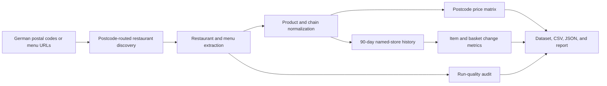

**Live Actor and maintained API: [Run German Delivery Menu Price Intelligence on Apify](https://apify.com/kamerozkan/german-delivery-menu-price-intelligence)**

# Lieferando Menu Scraper - Restaurant Menus, Prices & Delivery: Samples

Scrape restaurant menus and dish prices from Lieferando.de, Germany's largest food delivery platform: menu, price, delivery fee and minimum order per German postcode, 90-day price history, postcode price matrix and a run-over-run menu change digest. Unofficial, independent tool.

[Run Lieferando Menu Scraper - Restaurant Menus, Prices & Delivery on Apify](https://apify.com/kamerozkan/german-delivery-menu-price-intelligence)


Turn postcode-routed Lieferando restaurant listings into normalized menu rows, delivery economics, comparable product IDs, cross-postcode price matrices, 90-day history, and run-quality records.

> **Independent and unofficial.** This project is not affiliated with, endorsed by, sponsored by, or an official integration of Lieferando or Just Eat Takeaway.com. Platform names identify the public data source only.


## Current billing checked on October 6, 2026

Checked against the saved active Actor pricing on October 6, 2026. These are Free-tier event rates; use the [Pricing tab](https://apify.com/kamerozkan/german-delivery-menu-price-intelligence/pricing) for your plan and memory allocation. Historical samples below keep their original dates and do not prove current source availability.

Delivered menu items, restaurant fallback rows and menu-change summary rows cost $0.003 each. Postcode matrices, inflation summaries and the run summary have no result event. The active pricing has no `menu-change-digest` event; a successfully stored digest is marked `UNPRICED_FREE`. Startup is $0.005 per GB, minimum one event; default 2 GB adds $0.01. For 400 billable rows, event charges are $1.21 per run. A later failure or abort can retain earlier delivered and charged rows. The current Pricing tab shows platform costs included; the publisher still incurs compute and proxy costs. Row limits and charge limits do not prove complete menus or cap the publisher costs.

See [`pricing-verification-2026-10-06.json`](pricing-verification-2026-10-06.json) for the saved event configuration and scope.

## October 6, 2026 publication

The owner release check confirmed public `latest` build `1.0.20` (`eE9sRgiSUvumj6lg7`), its complete frozen source hashes and unchanged protected Actor settings. This publication did not run a new scrape. Older snapshots and sample outputs below retain their original dates; they are not evidence of current source availability, customer payment or satisfaction.


## Verified live snapshot

Audited through the public Store/API and the authenticated owner account on 2026-07-28.

| Evidence | Verified value |
|---|---|
| Store slug | `kamerozkan/german-delivery-menu-price-intelligence` |
| Actor ID | `dHYh0fcMQaXw4LS29` |
| Visibility | Public |
| Current `latest` build | `1.0.13`, build ID `xwV0cEjYP2mAMH8Os`, succeeded 2026-07-28 20:54:19 UTC |
| Public Store Examples | Exactly 1 |
| Public Example | [`monitor-berlin-restaurant-menu-prices`](https://apify.com/kamerozkan/german-delivery-menu-price-intelligence/examples/monitor-berlin-restaurant-menu-prices), Task ID `rMqmZE2BnOWQvaABo` |
| Public Example run count | 3 |
| Latest successful public Example run | `WqgwqjrdXgdavKAmH`, build `1.0.11` |
| Example run window | 2026-07-28 14:54:48 UTC to 14:56:33 UTC |
| Verified Example dataset | `hDVcOZ11Mfyt2hIMR`, 158 rows |
| Actor activity at audit time | 13 builds, 14 runs, 2 users; 2 successful public runs in the previous 30 days |

The current build is `1.0.13`, while the latest audited successful public Example run used build `1.0.11`. Output sample 1 is a privacy-minimized projection of the first visible row in the audited Example dataset. Samples 2 and 3 are privacy-minimized projections of real live-run records published in the Actor's current Store README.

## Public and recipe inputs

| Sample | Status | What it demonstrates |
|---|---|---|
| [`01_public_store_example_input.json`](01_public_store_example_input.json) | Public | Exact saved input of the only public Store Example and its audited successful run |
| [`02_quick_postcode_coverage_recipe_input.json`](02_quick_postcode_coverage_recipe_input.json) | Recipe, not run | Restaurant-list coverage without full-menu extraction or analytics |
| [`03_multi_postcode_price_matrix_recipe_input.json`](03_multi_postcode_price_matrix_recipe_input.json) | Recipe, not run | Two-postcode menu collection, comparable products, price history, and analytics |

## Buyer questions and guardrails

| Buyer question | Evidence available | Required guardrail |
|---|---|---|
| What menu prices and delivery terms are shown for a postcode? | `menu_item` and `restaurant` rows preserve the observed postcode context | Treat every value as a point-in-time source observation |
| Can equivalent products be compared? | Deterministic canonical and comparable product IDs include size, quantity, dietary, and variant attributes | Review normalization confidence and product attributes before commercial decisions |
| Is the same product priced differently by postcode? | `postcode_price_matrix` reports per-postcode min, average, max, branches, and spread | A matrix needs at least two inputs and an overlapping chain and comparable product |
| Can price movement be monitored? | Named-store history retains up to 90 days and exposes item and basket changes | The first run has no prior baseline, so change fields can be `null` |
| Can collection quality be monitored? | `run_summary` exposes failures, retries, missing-price rate, cuisine coverage, and issues | `healthy` is an Actor quality result, not a guarantee of complete market coverage |

## Pipeline



## Input examples

<details>
<summary><strong>1. Public Store Example: monitor Berlin menu prices</strong></summary>

```json
{
  "failOnQualityIssues": false,
  "generateAnalytics": true,
  "includeMenus": true,
  "maxRestaurantsPerPostalCode": 2,
  "postalCodes": ["10115"],
  "sendSuccessWebhook": false,
  "trackPriceHistory": true
}
```

Full file: [`01_public_store_example_input.json`](01_public_store_example_input.json)
</details>

<details>
<summary><strong>2. Recipe: quick postcode restaurant coverage</strong></summary>

```json
{
  "postalCodes": ["10115"],
  "maxRestaurantsPerPostalCode": 10,
  "includeMenus": false,
  "trackPriceHistory": false,
  "generateAnalytics": false
}
```

The complete current-schema recipe, including quality and proxy settings, is in [`02_quick_postcode_coverage_recipe_input.json`](02_quick_postcode_coverage_recipe_input.json). It was not executed as part of this audit.
</details>

<details>
<summary><strong>3. Recipe: two-postcode price matrix</strong></summary>

```json
{
  "postalCodes": ["10115", "10435"],
  "maxRestaurantsPerPostalCode": 2,
  "includeMenus": true,
  "trackPriceHistory": true,
  "generateAnalytics": true
}
```

The complete current-schema recipe is in [`03_multi_postcode_price_matrix_recipe_input.json`](03_multi_postcode_price_matrix_recipe_input.json). It was not executed as part of this audit.
</details>

## Verified and privacy-minimized outputs

Street addresses, coordinates, image URLs, menu descriptions, source product IDs, and request-correlation parameters are omitted. See [`DATA_NOTICE.md`](DATA_NOTICE.md).

<details>
<summary><strong>1. Menu item with postcode-specific delivery economics</strong></summary>

```json
{
  "recordType": "menu_item",
  "observedAt": "2026-07-28T12:54:55.070Z",
  "searchPostalCode": "10115",
  "chainName": "Burgermeister",
  "restaurantName": "Burgermeister Eberswalder",
  "deliveryTimeMin": 30,
  "deliveryTimeMax": 50,
  "deliveryFee": 2.99,
  "minimumOrder": 10,
  "category": "Lieferando Specials",
  "productName": "Lieferandomeister",
  "canonicalName": "lieferandomeister",
  "comparableProductId": "de-menu-v3:175fde3409fc8839c0289009",
  "normalizationVersion": "de-menu-v3",
  "price": 10.59,
  "isAvailable": true,
  "priceChange90d": 0,
  "priceChangePercent90d": 0
}
```

Full record: [`01_verified_menu_item_output.json`](01_verified_menu_item_output.json)
</details>

<details>
<summary><strong>2. Self-auditing run summary</strong></summary>

```json
{
  "recordType": "run_summary",
  "observedAt": "2026-07-28T12:27:40.624Z",
  "completedAt": "2026-07-28T12:29:09.422Z",
  "status": "healthy",
  "expectedPostalCodes": ["10115"],
  "resolvedPostalCodes": ["10115"],
  "scrapedRestaurantCount": 2,
  "menuItemCount": 79,
  "unavailableItemCount": 7,
  "failedRequestCount": 0,
  "failedRequestRate": 0,
  "retryRate": 0,
  "nullPriceRate": 0,
  "issues": [],
  "failures": []
}
```

Full record: [`02_verified_run_summary_output.json`](02_verified_run_summary_output.json)
</details>

<details>
<summary><strong>3. Cross-postcode comparable-product matrix</strong></summary>

```json
{
  "recordType": "postcode_price_matrix",
  "observedAt": "2026-07-28T20:31:44.957Z",
  "chainName": "Burgermeister",
  "canonicalName": "hamburger",
  "postalCodeCount": 2,
  "branchCount": 1,
  "lowestPrice": 7.1,
  "highestPrice": 7.1,
  "priceSpread": 0,
  "priceSpreadPercent": 0
}
```

Full record: [`03_verified_postcode_matrix_output.json`](03_verified_postcode_matrix_output.json)
</details>

## API quick start

```bash
curl -X POST \
  "https://api.apify.com/v2/acts/kamerozkan~german-delivery-menu-price-intelligence/runs?token=YOUR_APIFY_TOKEN" \
  -H "Content-Type: application/json" \
  --data-binary @01_public_store_example_input.json
```

Use [`dataset_record.schema.json`](dataset_record.schema.json) to validate consumer-facing dataset records. The schema covers `restaurant`, `menu_item`, `postcode_price_matrix`, `menu_inflation_summary`, and `run_summary` rows.

## Source and interpretation limits

- The Actor reads publicly displayed Lieferando restaurant and menu information. It does not provide an official Lieferando API.
- Markup, access controls, availability, menu contents, prices, fees, offers, ratings, and delivery estimates can change.
- Results are observations from requested postcodes and restaurant limits. They are not proof of nationwide completeness or real-time coverage.
- Lieferando can block data-center traffic. The current input defaults to a German residential Apify Proxy profile. The current Pricing tab shows platform costs included for customers; the publisher still incurs those resource costs.
- A restaurant can serve multiple search postcodes. Branch count and postcode count describe the observed run, not the platform's full service area.
- Comparable-product matching is deterministic but can still require review. Size, quantity, dietary, and variant attributes are included to reduce false matches.
- A first run does not prove a price change. Retain the same named key-value store across later runs to build history.
- Run-quality status reports configured thresholds and observed collection health. It is not an uptime SLA or a guarantee that every source field was available.
- Use conservative concurrency and confirm applicable laws, platform terms, data rights, privacy obligations, and retention requirements.

## License

Sample code and repository documentation are available under the [MIT License](LICENSE). Source data remains subject to its original rights, terms, and applicable law.

## October 6 failure-status repair

Input, crawler or storage exceptions and strict quality failures now preserve a nonzero process exit instead of being masked by a default successful shutdown. `failOnQualityIssues: false` still permits a completed run with failed or degraded quality in its summary. The caller must inspect summary quality and dataset contents. Partial records and their earlier charges can remain after a later failure. Eight author cases and eight independent cases passed with simulated SDK, crawler and storage behavior, without a live scrape. See [`lifecycle-verification-2026-10-06.json`](lifecycle-verification-2026-10-06.json).

The current [`input_schema.json`](input_schema.json) includes the corrected billing field descriptions; input types, defaults and validation constraints were preserved.
